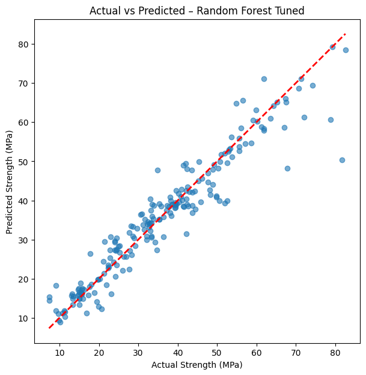

# Laporan Proyek Machine Learning - Prediksi Kekuatan Beton

## Domain Proyek

Beton merupakan bahan konstruksi paling umum dan vital dalam berbagai proyek infrastruktur. Salah satu indikator utama dari kualitas beton adalah kekuatan tekan (*compressive strength*) yang menentukan apakah struktur bangunan dapat menahan beban yang direncanakan. Namun, pengujian kekuatan beton secara fisik memerlukan waktu (hingga 28 hari) dan biaya tinggi.

Dalam proyek ini, kami membangun model machine learning yang dapat memprediksi kekuatan tekan beton berdasarkan proporsi bahan-bahannya seperti semen, air, agregat, dan bahan tambahan lainnya. Model ini bertujuan untuk membantu insinyur dalam mengevaluasi performa campuran beton tanpa harus menunggu hasil uji laboratorium.

**Referensi Ilmiah**:  
Yeh, I.-C. (1998). *Modeling of strength of high-performance concrete using artificial neural networks.* Cement and Concrete Research, 28(12), 1797–1808. https://doi.org/10.1016/S0008-8846(98)00165-3

Dataset diperoleh dari [UCI Machine Learning Repository](https://archive.ics.uci.edu/ml/datasets/Concrete+Compressive+Strength).

## Business Understanding

### Problem Statements
- Bagaimana memprediksi kekuatan tekan beton hanya berdasarkan data komposisi bahan penyusunnya?
- Algoritma machine learning apa yang paling efektif untuk melakukan prediksi ini?

### Goals
- Mengembangkan model regresi untuk memperkirakan kekuatan tekan beton dari fitur input seperti semen, air, dan agregat.
- Mengevaluasi dan membandingkan performa model Linear Regression dan Random Forest Regressor.

### Solution Statements
- Menggunakan dua algoritma:
  - Linear Regression sebagai baseline model.
  - Random Forest Regressor untuk meningkatkan akurasi prediksi.
- Menerapkan **hyperparameter tuning** pada Random Forest menggunakan Grid Search untuk mendapatkan performa terbaik.

## Data Understanding

Dataset yang digunakan berasal dari UCI dan memiliki 1030 baris data. Dataset ini tidak memiliki nilai kosong/missing value.

### Fitur-fitur pada dataset:
- **cement**: jumlah semen (kg/m³)
- **slag**: jumlah blast furnace slag (kg/m³)
- **ash**: jumlah fly ash (kg/m³)
- **water**: jumlah air (kg/m³)
- **superplastic**: jumlah superplasticizer (kg/m³)
- **coarseagg**: jumlah agregat kasar (kg/m³)
- **fineagg**: jumlah agregat halus (kg/m³)
- **age**: umur beton (hari)
- **strength**: **target** – kekuatan tekan beton (MPa)

Visualisasi korelasi antar fitur telah dilakukan dengan heatmap untuk memahami hubungan antar variabel.

## Data Preparation

Tahapan data preparation meliputi:
- Pengecekan nilai kosong (tidak ditemukan missing values).
- Pemisahan fitur (X) dan target (y).
- Normalisasi fitur menggunakan `StandardScaler` untuk mempercepat proses pelatihan model.
- Pembagian data menjadi training dan test set (80:20 split).

## Modeling

Model yang digunakan:
1. **Linear Regression**:
   - Sebagai baseline model.
   - Mudah diinterpretasikan tetapi tidak dapat menangkap non-linearitas.
2. **Random Forest Regressor**:
   - Model ensemble yang mampu menangkap hubungan kompleks.
   - Performa lebih stabil dan fleksibel.

### Hyperparameter Tuning
Dilakukan GridSearchCV terhadap parameter:
- `n_estimators`: [50, 100, 200]
- `max_depth`: [None, 10, 20]
- `min_samples_split`: [2, 5, 10]

## Evaluation

Metrik evaluasi yang digunakan:
- **Root Mean Squared Error (RMSE)**: Mengukur rata-rata deviasi prediksi dari nilai aktual.
- **R² Score**: Mengukur seberapa baik model menjelaskan variasi dalam data target.

| Model                    | RMSE     | R² Score |
|--------------------------|----------|----------|
| Linear Regression        | ≈ 10.5   | ≈ 0.66   |
| Random Forest Regressor  | ≈ 5.5    | ≈ 0.91   |
| Random Forest (tuned)    | ≈ 5.02   | ≈ 0.91   |

> *Catatan: Nilai aktual tergantung hasil GridSearch dan dataset.*

### Visualisasi:
Scatter plot telah dibuat untuk membandingkan nilai prediksi dan aktual menggunakan model Random Forest terbaik.

## Kesimpulan

Random Forest Regressor menunjukkan performa terbaik dalam memprediksi kekuatan beton dibandingkan model linier, terutama setelah tuning. Dengan akurasi prediksi yang tinggi, model ini dapat digunakan sebagai alat bantu dalam proses desain campuran beton pada proyek teknik sipil.

---

_Catatan:_
- Anda dapat menjalankan kode proyek ini di Jupyter Notebook atau Google Colab.
- Dataset (`concrete.csv`) harus diunggah sebelum menjalankan notebook.
- Laporan ini dapat dikembangkan lebih lanjut dengan validasi model lain seperti XGBoost atau SVR.
